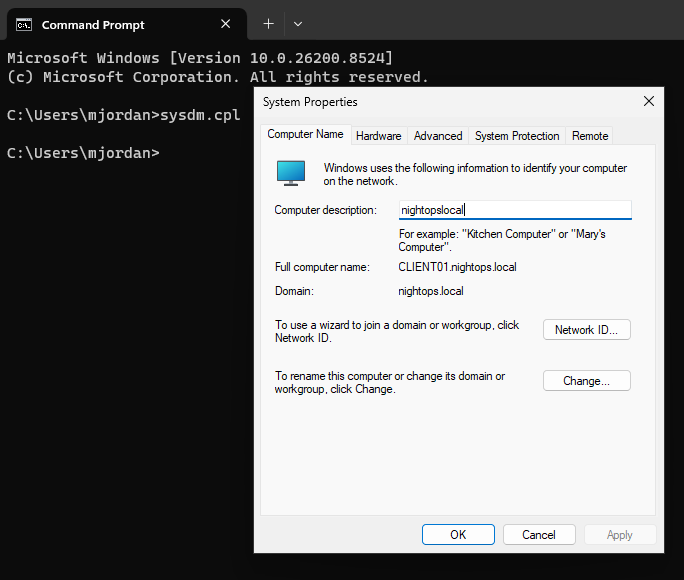

# Active-Directory-Home-Lab
Windows Active Directory Home Lab - Built for Cybersecurity portfolio
# 🖥 Active Directory Home Lab

## 🎯 Objective
Built a functional Windows domain environment using Active Directory to simulate a real small business network. This project demonstrates core IT and cybersecurity skills.

## 🛠 Technologies Used
- **VirtualBox** - Virtualization Platform
- **Windows Server 2022** - Domain Controller
- **Windows 11 Pro** - Client Machine
- **Active Directory Domain Services**
- **Group Policy Management**

## 🔐 Skills Demonstrated
- Windows Server installation and configuration
- Active Directory Domain Controller setup and promotion
- Organizational Unit (OU) design and management
- User account creation and administration
- Static IP configuration and networking
- Domain join and authentication
- Group Policy configuration (Password Policy)

## 📸 Screenshots

### Domain Controller Setup

### Client & Domain Join

### Lab Environment

## 📚 Lessons Learned
- Deploying and managing a full Active Directory infrastructure
- Best practices for OU structure and user management
- Troubleshooting domain connectivity issues
- Configuring security policies through Group Policy
- Understanding virtualization and networking in enterprise environments

## 🚀 Next Steps (In Progress)
- Create domain users and groups | Done
- Join Windows 11 client to the domain | Done
- Configure Group Policy Objects (Password Policy, etc.) | Done
- Document troubleshooting steps | Done

## 🚀 Why This Project Matters
This lab closely mirrors real-world responsibilities in **Help Desk, IT Support, System Administrator, and Junior Cybersecurity** roles. It showcases practical hands-on experience with technologies widely used in enterprise environments.
